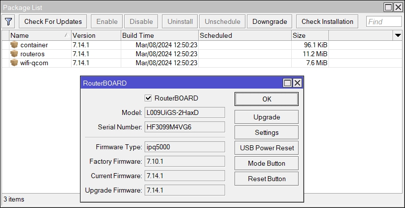
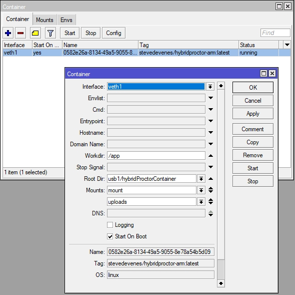

---
tags:
- setup_guide
---

# Setup Guide

You will need a [Mikrotik router](../../router/index.md), a USB key with an ext4 partition and two ethernet cables, one to connect the router to your pc and the other one to give internet access to the router.

## Powering up and updating os version

1. Power up router (don't forget to plug in the antenna!). Connect to your PC via ethernet cable.
1. Provide an internet connection to the router via another ethernet cable. 
1. Install and start winBox, you should see your device listed.
1. Login to it with the admin pwd written on the bottom of your device (**admin/WBJ6PZ033W**), now it should be **admin/{{WinBox_password}}**.
1. Install latest version (*7.14.1*) of routerOS, you will need routerOS > *V7.5* to be able to run containers. This can be done from inside WinBox by opening **System/Package**.
1. You may also need to update the routerBoard Version in **system/RouterBOARD**.
    {: .center width="600px"}

1. Install the container.npk. Download the [all_package zip](https://mikrotik.com/download) corresponding to your hardware architecture and software version (check with */system/resource/print*), extract and drop the container.npk into winBox and restart the router with */sys reboot*. After restarting, you should see a new tab called container in WinBox.
1. To activate the container feature, enter */system device-mode update container=yes* in the terminal. Then press the reset button of the router when asked so.

## Configuration setup

A configuration script of a working system has been exported and is available in the github repo in **router_config/config.rsc**.

1. Upload config.rsc to the router via WinBox.
2. Import the script if not executed automatically:
    ```bash
    import config.rsc
    ```
3. You can also run and adapt the commands listed in config.rsc manually in the router terminal if something is not working.

## Upgrading the container image

If you already have a working router but need to upgrade only the container image you can do the following:

1. Login via WinBox.
1. Make sure to give an internet access to the router via a ethernet cable.
1. Open the **Container** window to stop and delete the current container.
1. Open a terminal and enter:
    ```bash
    add remote-image=stevedevenes/hybridproctor-arm:latest interface=veth1 root-dir=usb1/hybridProctorContainer start-on-boot=yes mounts=mount,uploads
    ```
1. The container should appear in the **Container** window: Start it!
    {: .center width="600px"}


## Changing the Wifi SSID / password
To avoid having multiple wifi with the same name, please change the SSID of any new configured system.

1. In the **Wifi** window, open the *wifi1* network pannel.
1. Change the SSID in the *Configuration* tab
1. Change the passphrase in the *Security* tab.
