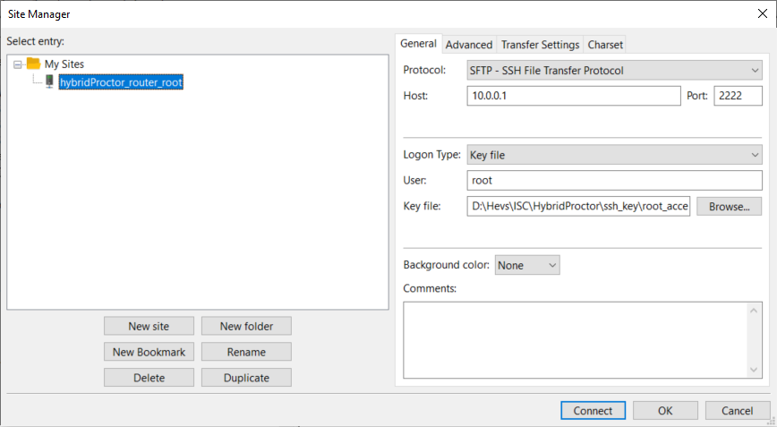

---
tags:
- usage_guide
---

# Usage Guide

## Creating the exam statement

To use this system you need to have your exam statement in a single html file. Please have a look at [this repo](https://github.com/ISC-HEI/isc_templates) which provide tools and examples to generate html from markdown or latex.

## Deploying the exam

1. Plug the USB key in the router and power up the later (don't forget to plug in the antenna!).
1. Connect to it via wifi (**password: {{wifi_password}}**).
1. Connect to router via sftp to adapt the config for your exam. You will need the private ssh key provided by [Steve Devènes](mailto:steve.devenes@hevs.ch) to connect.

    You can connect either via a terminal or by using a ssh client like FileZilla:

    === "Terminal"
    
        ```bash
        sftp -i /path/to/ssh_key -P 2222 root@10.0.0.1
        ```

    === "FileZilla"

        This is the config you need to connect via FileZilla, make sure to adapt the <key file> to match your ssh key path.
        {: .center width="600px"}

    Once connected, here's what you can change:

    * The *statement of your exam*, replace **/mount_point/html/exam.html**.
    * The *ressources* to be downloaded by the students, put them in **/mount_point/html/resources**. Delete the content of the directory if you don't have any.
    * Optionally: The *list of files the students have to submit*. You can list these files in  **/mount_point/html/config.yml**, or disable the option.

    Please, don't delete or modify any other files in **/mount_point/html/**.

1. Go to [10.0.0.1]() and check if your exam/resources are really there and if everything is working (try downloading ressources and uploading files).

## During the exam

1. Provide the wifi password to the students and ask them to connect.
1. Students can then do the exam and upload their files.
1. Once finished, you can retrieve the submitted files via sftp, they are located in **/home/admin/uploads**. 

    !!! warning
        Make sure the students files are really uploaded and accessible through sftp before they leave!

    !!! danger
        The current version of the system doesn't provide a way to check if students still have an internet access, and also if they are still connected to the router. This is planned in future version. For now you will have to keep an eye on the students during the exam.