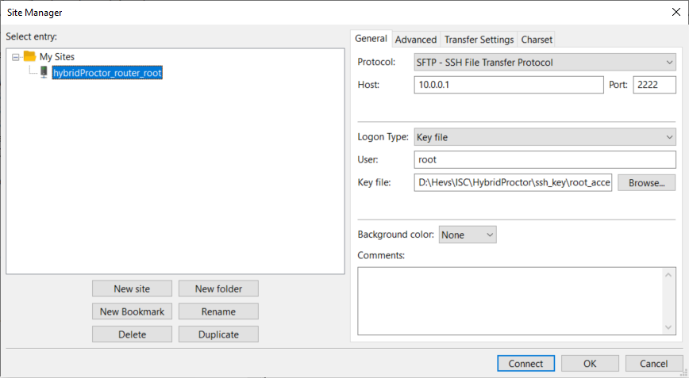

---
tags:
- usage_guide
---

# Usage Guide

## Creating the exam statement

To use this system you need to have your exam statement in a single html file. Please have a look at [this repo](https://github.com/ISC-HEI/isc_templates) which provide tools and examples to generate html from markdown or latex.

## Deploying the exam

1. Plug the USB key in the router and power up the later (don't forget to plug in the antenna!).
1. Connect to it via wifi (**password: {{wifi_password}}**).
1. Go to [http://172.30.0.1/admin/configure]() and copy the displayed password somewhere safe (if a new password was generated).
1. Follow the instructions. First, upload the statement. Then, optionally set the list of files the students have to submit (can be skipped by unchecking the corresponding checkbox). And finally, the resources to be downloaded by the students.
1. Alternatively, you can connect to router via sftp to adapt the config for your exam. You will need the private ssh key provided by [Steve Devènes](mailto:steve.devenes@hevs.ch) to connect.

    You can connect either via a terminal or by using a ssh client like FileZilla:

    === "Terminal"
    
        ```bash
        sftp -i /path/to/ssh_key -P 2222 root@172.30.0.1
        ```

    === "FileZilla"

        This is the config you need to connect via FileZilla, make sure to adapt the <key file> to match your ssh key path.
        {: .center width="600px"}

    Once connected, here's what you can change:

    * The *statement of your exam*, replace **/app/public/exam.html**.
    * The *ressources* to be downloaded by the students, put them in **/app/public/resources**. Delete the content of the directory if you don't have any.
    * Optionally: The *list of files the students have to submit*. You can list these files in  **/app/public/config.yml**, or disable the option.

1. Go to [http://172.30.0.1]() and check if your exam/resources are really there and if everything is working (try downloading ressources and uploading files).

## During the exam and after

1. Provide the wifi password to the students and ask them to connect.
1. Students can then do the exam and upload their files.
1. You can monitor the exam on [http://172.30.0.1/admin/monitor](). Here you can see logs in real time and who's connected since when.
1. Once finished, you can retrieve the submitted files using the integrated file explorer at [http://172.30.0.1/admin/explorer]() or via sftp (or power off the router and mount the usb key onto your computer), they are located in **/mount_point/uploads** (or **mount/uploads** if done using the USB key).

    !!! info
        HybridProctor now has a handshake, the student needs to give the latest files hash to end his exam. This means that only the vXXX_validated labeled folder files can be evaluated. This folder also contains the hash, which means that in case of an appeal you can check if the hash compares to the one of the appeal. 

    !!! warning
        Make sure the students files are really uploaded and accessible through the file explorer or sftp before they leave!

    !!! danger
        The current version of the system doesn't provide a way to check if students still have an internet access. For now you will have to keep an eye on the students during the exam.

## Password

It is really simple to reset the password.

1. Power off the router and mount the USB key onto your computer and remove the **mount/.password** file.
1. Plug the USB key back in the router and power it on.
1. Go to [http://172.30.0.1]() and copy the displayed password somewhere safe.
