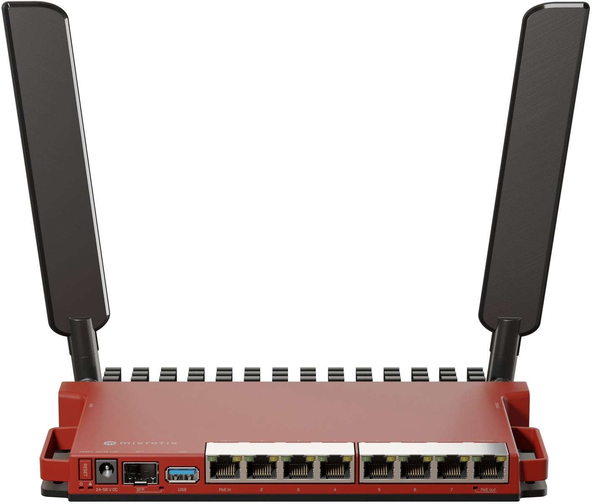

---
hide:
- navigation
- toc
---

# The router

Identifier:

* [Router L009UiGS-2HaxD-IN 2.4 GHz ax dual-chain Wi-Fi](https://www.brack.ch/fr/mikrotik-routeur-l009uigs-2haxd-in-2-4-ghz-ax-dual-chain-wi-fi-1568645)

This router, from Mikrotik, allows to create and manage containers natively. The only thing required is to plug an USB device to store the containers data as the Mikrotik doesn't have a lot of internal memory. 

{: .center width="600px"}
